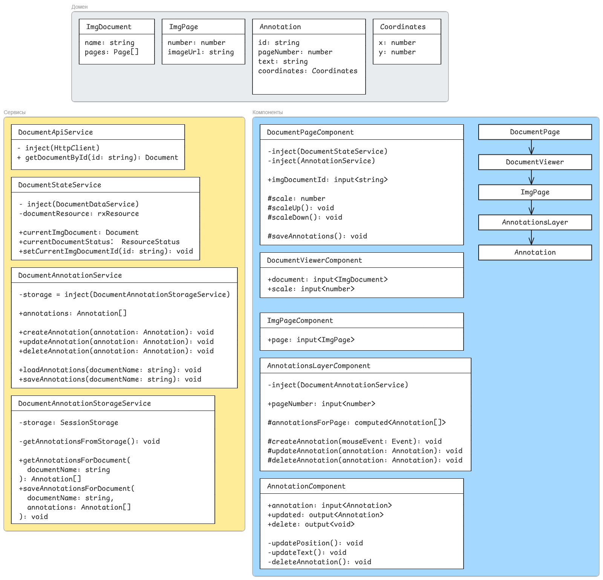

# ClearWay Тестовое задание

Для добавления аннотаций кликните дважды в области страницы.

Редактирование текста и перемещение происходит после клика на аннотацию.

## Архитектура

## Плюсы

- Разделение зон ответственности сервисов и компонентов без пересечения абстракций
- Signals API

## Минусы и проблемы

- Просмотрщик адаптирован только под вертикальный формат А4. Скорее всего можно хранить размеры страницы в его модели и используя их отображать страницы.
- Все изображения грузятся сразу, нет lazy-подгрузки. Можно используя `IntersectionObserver` следить за текущей страницей и грузить соседние страницы, и удалять из DOM ненужные.
- Аннотации плохо работают у краев изображения. Можно помимо координат аннотации хранить размеры, привязанные к textarea и использовать их в расчете положения.
- Контролы в `DocumentPageComponent` определены как часть этого компонента. Если бы контролов было больше в идеале все перенести в отдельный компонент тулбара
- `withComponentInputBinding()` в `app.config.ts` слабо связывает имя параметра в `documemt-viewer.routers.ts` с `input` в `document-page.component.ts`. При переименовании возможны расхождения. Тут сделано так для удобства, чтобы не использовать `ActivatedRoute`.
